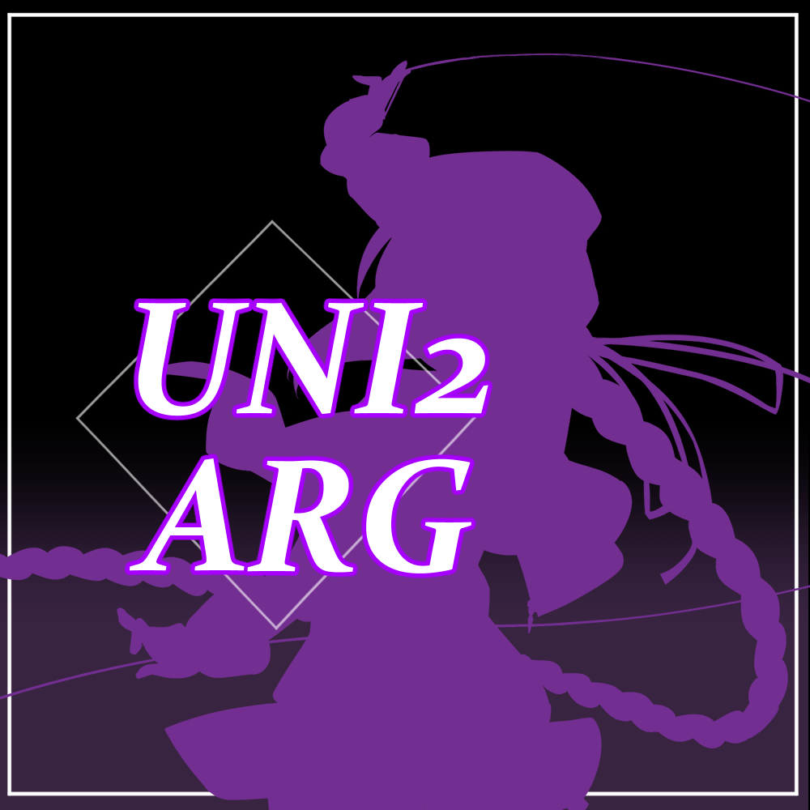

<!DOCTYPE html>
<html lang="es">
<head>
    <meta charset="UTF-8">
    <meta name="viewport" content="width=device-width, initial-scale=1.0">
    <title>Under Night In Birth Sys Celes - Argentina</title>
    <!-- Enlace a Font Awesome para los iconos -->
    <link rel="stylesheet" href="https://cdnjs.cloudflare.com/ajax/libs/font-awesome/6.5.1/css/all.min.css">
    
</head>
<body>

    

        <!-- Logo Principal -->
        <!-- Reemplaza 'logo.png' con la ruta de tu imagen de logo -->
        

        <!-- Título -->
        <h1>Under Night In Birth Sys Celes  Argentina</h1>

        <!-- Descripción -->
        

            Comunidad argentina de Under Night In-Birth enfocándose en torneos, exhibiciones, eventos y más.
        

        <!-- Enlaces con iconos (solo se ven los iconos) -->
        

            <!-- Discord -->
            <a href="https://discord.gg/jA4W3WnQVP" target="_blank" rel="noopener noreferrer" title="Discord">
                <i class="fab fa-discord"></i>
            </a>
            <!-- Twitch -->
            <a href="https://www.twitch.tv/uniargentina" target="_blank" rel="noopener noreferrer" title="Twitch">
                <i class="fab fa-twitch"></i>
            </a>
            <!-- Twitter / X -->
            <a href="https://x.com/UnderNightARG" target="_blank" rel="noopener noreferrer" title="Twitter / X">
                <i class="fab fa-twitter"></i>
                <!-- Si prefieres el icono de X en vez del pajarito, reemplaza la línea de arriba por:
                <i class="fa-brands fa-x-twitter"></i> -->
            </a>
            <!-- YouTube -->
            <a href="https://www.youtube.com/@UnderNightArgentina" target="_blank" rel="noopener noreferrer" title="YouTube">
                <i class="fab fa-youtube"></i>
            </a>
        

   
</body>
</html>
